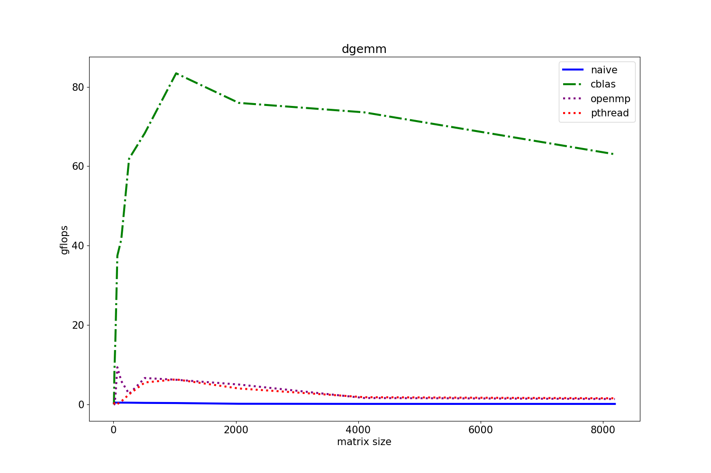

#### 实验环境
1. 操作系统版本：Linux localhost 5.15.153.1-microsoft-standard-WSL2 #1 SMP Fri Mar 29 23:14:13
UTC 2024 x86_64 x86_64 x86_64 GNU/Linux
2. 编译器版本：gcc (Ubuntu 13.2.0-23ubuntu4) 13.2.0
3. CPU的物理核数：16
4. CPU的频率：2419.199
#### 简单介绍
1. `Cblas.c`：基于`Cblas`库的实现
2. `DGEMM.c`：基于`pthread.h`库自己手写的多线程的矩阵乘法实现
3. `MMult0.c`：最经典的朴素矩阵乘法实现
4. `openmp_gemm.c`：采用`OpenMP`并行编程的矩阵乘法实现
#### `gflops`曲线图

汇总分析说明：
1. 从图中可以看出`Cblas`的效率是所有实现中效率最高的，`Cblas`的效率先增大后减小，在矩阵边长介于1000到2000之间时达到最大，后效率下降不明显
2. 在矩阵边长较小时，这四种实现的效率相似
3. 当矩阵边长增大时，`Cblas`的效率显著提升，而`OpenMP`的实现在一定程度上跟上了`Cblas`的效率（`OpenMP`的库可能在矩阵边长较小时做了优化）
4. 随着矩阵边长的逐渐增大，`OpenMP`的实现跟不上`Cblas`的效率，曲线逐渐与`pthread`重合（这主要是因为二者的原理都是差不多的，都为多线程并行运算加速矩阵乘法）
5. 最经典的朴素矩阵乘法实现的效率是所有实现中最低的
#### 回答问题
1. 开启OpenMP时的CPU利用率： $104.0%$
2. 能体现OpenMP开启多个线程的截图
   
##### lab3
1. 可执行文件只会调用`new`对应的`.c`文件中的`MY_MMult`函数
   
   是由对象文件列表：`OBJS  := $(BUILD_DIR)/util.o $(BUILD_DIR)/REF_MMult.o $(BUILD_DIR)/test_MMult.o $(BUILD_DIR)/$(NEW).o`决定的，而最终的编译命令是这一行：
   
   ```
   $(BUILD_DIR)/test_MMult.x: $(OBJS) defs.h
	$(LINKER) $(OBJS) $(LDFLAGS) -o $@
   ```
2. 采用了重定向的方式写入文件
   
   首先，`makefile`中运行`@echo "date = 'date';" > $(DATA_DIR)/output_$(NEW).m`，它把当前日期写入到`output_openmp_gemm.m`文件中，使用 > 表示创建新文件或覆盖旧文件
   
   然后，运行`@echo "version = '$(NEW)';" >> $(DATA_DIR)/output_$(NEW).m`，这一行将版本信息追加到文件中，使用 >> 表示追加到文件末尾而不是覆盖
   
   最后执行`$(BUILD_DIR)/test_MMult.x >> $(DATA_DIR)/output_$(NEW).m`，这里`$(BUILD_DIR)/test_MMult.x`是之前编译好的可执行文件，执行后会将其标准输出重定向追加到`output_openmp_gemm.m`
##### lab5
1. 值得记录的问题
   
   `top`工具中看不出使用了多线程，但是数据的确与`OpenMP`相似，问题未能解决
2. `CPU`利用率：104.9
   
   能体现多线程的运行截图
   
   始终看不到多线程的结果
   